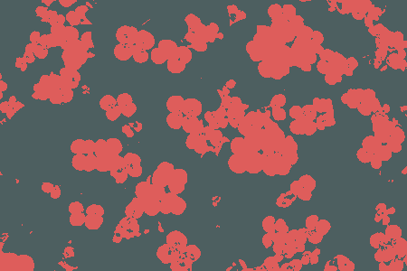
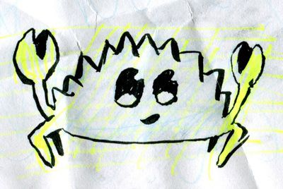
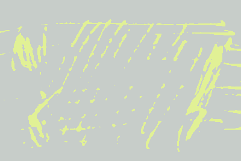
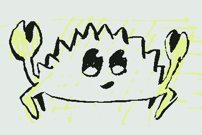
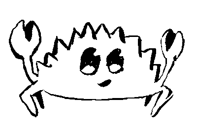
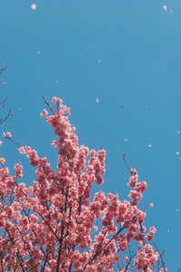
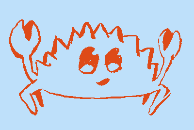

# kmeans-colors
[](https://travis-ci.com/okaneco/kmeans-colors)
[](https://crates.io/crates/kmeans-colors)
[](https://docs.rs/kmeans_colors)

Calculate the `k` average colors in an image using k-means clustering with
k-means++ initialization.

`kmeans-colors` wraps around a generic [k-means library][lib] that supports
Lloyd's and Hamerly's algorithms for arbitrary data types. k-means can find the
dominant colors or color palette of an image. Other applications in this crate
are binarization and "color style" transfer.

[lib]: https://docs.rs/kmeans_colors/



## 1) Basic usage

k-means clustering works by starting with an initial random guess of the `k`
number of colors in the image called `centroids`. For each step, every pixel in
the image is traversed to find what centroid is closest to it in color. Then,
the centroids calculate the average of all the colors close to them and move to
that color. This process repeats until the centroids stop moving or the maximum
step count is reached.

```
kmeans_colors -i gfx/pink.jpg -k 2 -o pink2
```

The animation above is a composite of k=2 to k=9 k-means with the preceding
command. `-k` is the number of colors to find in the image. `-r` is the amount
of runs to perform, `-o` specifies the output. By default, the images will save
as .png files. The `-o` option is not required.

## 2) Color palettes

```
kmeans_colors -i gfx/mountains.jpg --no-file --palette
```


```
kmeans_colors -i gfx/pink.jpg --no-file --palette --proportional
```


```
kmeans_colors -i gfx/flowers.jpg --no-file --palette --proportional --sort
```


By default, palettes will be composed of equally sized swatches. Passing
`--proportional` will scale the swatches proportionally to their presence in the
image. The default sorting method is from darkest to lightest, passing `--sort`
will rearrange the palette in order from most frequent to least frequent color.
The `--height` and `--width` of the palette can be specified as well as output
name with `--op`. Passing `-k 1` will produce the average color of the image.
`--no-file` is passed to bypass saving the result of the original image.

## 3) The `find` subcommand

### a) Binary Ferris Example

We can use k-means to clean up this doodle and extract the line work from it.
The paper this is on is folded and scribbled over with highlighter and blue
pencil, the back of the sheet also has ink on it.



---

```
kmeans_colors -i gfx/ferris.jpg -k 2 -o gfx/ferris-2color.png
```


The first attempt uses 2 colors, unfortunately this only picks up the color of
the highlighter and the average of the ink and paper.

---

```
kmeans_colors -i gfx/ferris.jpg -k 3 -o gfx/ferris-3color.png
```


Next, we try with k=3. This is a lot better and shows us that we can separate
marker colors from ink too. But it's still not what we want.

---

```
kmeans_colors find -c 000000,ffffff -i gfx/ferris.jpg -o gfx/ferris-find.png
```


The solution to effective black and white separation is using the `find`
subcommand with the `-c` option, which allows us to specify the colors black
(#000000) and white (#ffffff). The k-means algorithm will only need one
iteration to find the nearest colors in the image to the colors passed with
`-c`.

### b) The `--replace` flag

With `--replace`, we run the k-means calculation on an image and replace the
centroids with our own custom colors. The colors we input will replace the
centroids in order from darkest to lightest, and the number of colors we use
will be the amount of k-means centroids we calculate; if we specify 4 colors, we
would be replacing the color groups we'd calculate using `-k 4` as in Example 1.

 

We can transfer the average colors of the left image to the lanterns on the
right. Running the following command prints the 12 colors below in order from
darkest to lightest in hexadecimal.

```
kmeans_colors -i gfx/flowers.jpg -p -k 12 --no-file
```
```
492f38,6c363e,8d444e,ae525b,8c6779,677a9b,b87078,4b95bb,a499b0,d7969d,e3b8c0,c5c6da
```

Then, we can use those colors with the `-c` option on the right image.

```
kmeans_colors find -i gfx/lanterns.jpg -c 492f38,6c363e,8d444e,ae525b,8c6779,677a9b,
b87078,4b95bb,a499b0,d7969d,e3b8c0,c5c6da --replace
```


The top half of the image is the previous command which runs in Lab mode by
default. The bottom half of the image was the previous command passed with the
addition of the `--rgb` flag.

Passing the same colors without `--replace` results in the image below, which
colors the pixels with the closest color found in the list we supplied.

```
kmeans_colors find -i gfx/lanterns.jpg -c 492f38,6c363e,8d444e,ae525b,8c6779,677a9b,
b87078,4b95bb,a499b0,d7969d,e3b8c0,c5c6da
```


---

Returning to the Ferris example, we can recolor the image using `--replace`.

```
kmeans_colors find -i gfx/ferris-find.png -c de4a18,bee0fa --replace -o gfx/ferris-replace.png
```



`-r` and `-m` can be used with the `find --replace` subcommand and flag
combination. They don't do anything with `find` by itself, since only one
iteration is needed to produce the result.

## 4) Print, Percentage, & Verbose

`kmeans_colors -i gfx/pink.jpg -k 2 -pv --pct --no-file`

The results of the iterations can be printed with the `-v` verbose flag. The
score gets smaller as the colors converge. This can be helpful for
troubleshooting if results are unexpected since the k-means may not have
converged. The `-p` flag prints the colors in hexadecimal ordered from darkest
to brightest as seen below. The `--pct` flag prints the percentage of each color
present in the resulting image.

```
gfx/pink.jpg
Score: 62.90416
Score: 0.05048233
Iterations: 1
4e5f60,dc5d5c
0.6605,0.3395
```

## *Usage Notes:*
k-means can get stuck in local minima which prevent it from finding the best
result. To combat this, the amount of runs can be specified with `-r` to repeat
the process and keep the best result. The `-m` flag can be used to specify the
max amount of iterations to perform. Lastly, the convergence factor can be
specified with `-f`. Larger image files will take longer to complete so
defaults were carefully selected for each of these.

The `--transparent` flag can be passed when working with transparent PNG images.
The k-means will be calculated without factoring in any pixels with
transparency. Otherwise, transparent pixels become matte and negatively impact
the results.

## Features
- create a color palette from an image
- Lab space or RGB space calculations
- find the nearest colors to input colors
- replace the colors with custom colors
- adjustable iteration count and repetition
- print the average colors
- print the percentage of each color in the image
- transparency support
- kmeans++ center initialization
- supports multiple images as input to batch process
- specify random seed for reproducible results

## License
This crate is licensed under either
- the [MIT License](LICENSE-MIT), or
- the [Apache License (Version 2.0)](LICENSE-APACHE)

at your option.
